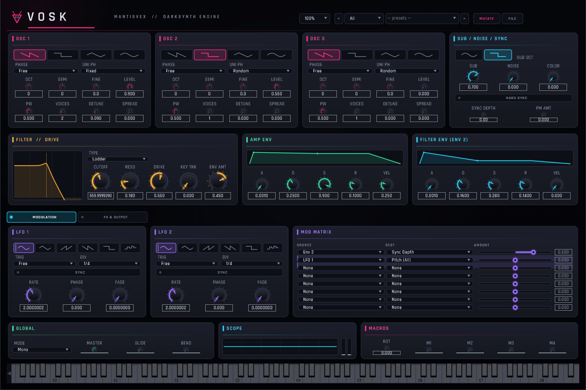

# VOSK

**A darksynth / cyberpunk synthesizer, built for bass violence and searing leads.**

<p align="center"></p>

VOSK is a subtractive virtual-analog synth (VST3 / AU / Standalone) aimed squarely at
darksynth, synthwave and cyberpunk — the Carpenter Brut / Perturbator / Magonia end of
the spectrum. Three band-limited oscillators with per-oscillator super-saw unison, hard
sync and phase mod feed a driven, oversampled Moog-ladder or MS-20-style filter, a full
modulation system, a global FX chain, an output saturation stage and a tape/VHS colour.
It ships with ~60 ready-to-play patches and gets nasty fast.

Built with [JUCE](https://juce.com). Free and open source (GPLv3).

## Download

Grab the latest build from the **[Releases page](https://github.com/mantisvex/VOSK/releases/latest)**.

- **Windows** — `VOSK-*-Windows.zip` (VST3 + Standalone). Put `VOSK.vst3` in
  `C:\Program Files\Common Files\VST3\`, then rescan plugins in your DAW.
- **macOS** — `VOSK-*-macOS.zip` (VST3 + AU + Standalone). Copy `VOSK.vst3` to
  `~/Library/Audio/Plug-Ins/VST3/` and `VOSK.component` to
  `~/Library/Audio/Plug-Ins/Components/`. The macOS builds are **unsigned**, so on first
  launch right-click → **Open** (or run `xattr -cr /path/to/VOSK.vst3`) to get past
  Gatekeeper.

Factory presets are built in — nothing else to install.

## Features

**Oscillators**
- 3 identical oscillators (Saw / Pulse / Triangle / Sine), band-limited so they stay
  clean all the way up the keyboard — no digital fizz on high notes.
- Per-oscillator **super-saw unison** (up to 7 voices) with musical non-linear detune,
  stereo spread and random/fixed phase.
- **Hard sync** and **phase modulation** for growl and metallic grit.
- **Sub oscillator** (sine/square, −1/−2 oct) and a **noise** source with a white→dark
  tone tilt.

**Filter & drive**
- **Pre-filter drive** with an asymmetric soft-clip, feeding a choice of two filters:
  a smooth **Moog-style 24 dB ladder** or a nastier **MS-20 / Sallen-Key**. Both
  self-oscillate. Everything runs oversampled to stay clean under heavy drive.
- Dedicated **filter envelope**, key tracking and a live filter-response graph.

**Modulation**
- Two envelopes and two **tempo-syncable LFOs** (6 shapes incl. sample & hold).
- An **8-slot modulation matrix** routing anything to pitch, level, PW, sync depth, PM,
  unison, cutoff, resonance, drive, pan and more — ships pre-wired for the classic
  envelope-swept bass growl.

**Output & FX**
- Global **output character stage** — Tube / Diode / Fold / Crush saturation, the
  amp-distortion grit that makes it sound like a record.
- **FX chain**: Juno-style chorus, tempo-synced ping-pong delay, and a dark reverb.
- **Tape / VHS** stage: wow & flutter, tape saturation, vintage hiss and roll-off.

**Voicing**
- 8-voice **poly**, plus **mono** and **legato** with exponential glide and pitch bend.

**Interface**
- Custom darksynth UI with live visual feedback everywhere: oscilloscope + stereo
  meters, ADSR envelope curves, filter-response graph, LFO phase indicators and
  mod-matrix routing highlights.
- Resizable **UI scale** (75–150 %), an **on-screen keyboard**, and an embedded font so
  it looks the same on every machine.

**Presets**
- ~60 factory patches across Bass / Lead / Pluck / Keys / Stab / Pad / Arp / FX, all
  level-matched so browsing won't blow your ears out.
- **MUTATE** button that generates usable darksynth patches on demand.
- Save your own, and **import / export** single presets (`.voskpreset`) or whole banks
  (`.voskbank`) to share.

## Build from source

Requires **CMake ≥ 3.22** and a **C++17** compiler. JUCE is fetched automatically, so a
clean checkout builds anywhere:

```sh
git clone https://github.com/mantisvex/VOSK.git
cd VOSK
cmake -B build -DCMAKE_BUILD_TYPE=Release
cmake --build build --config Release
```

Build products land in `build/VOSK_artefacts/` (VST3, Standalone, and AU on macOS).
An [Inno Setup](https://jrsoftware.org/isinfo.php) installer script and a quick local
install helper are in [`installer/`](installer/).

Want to hack on it? See **[CONTRIBUTING.md](CONTRIBUTING.md)** for the architecture, DSP
notes and dev workflow.

## Credits

- Built on the [JUCE](https://juce.com) framework.
- Super-saw unison follows Adam Szabo, *"How to Emulate the Super Saw"* (BTH, 2010).
- Filter designs after Vadim Zavalishin's *The Art of VA Filter Design* and Will
  Pirkle's Korg35 model.
- UI font: [Rajdhani](https://fonts.google.com/specimen/Rajdhani) (SIL Open Font License).

## License

VOSK is released under the **GNU General Public License v3.0** — see [`LICENSE`](LICENSE).
Copyright © 2026 MantisVex. The embedded UI font is licensed separately under the SIL
Open Font License (see [`Resources/FONT-OFL.txt`](Resources/FONT-OFL.txt)).
